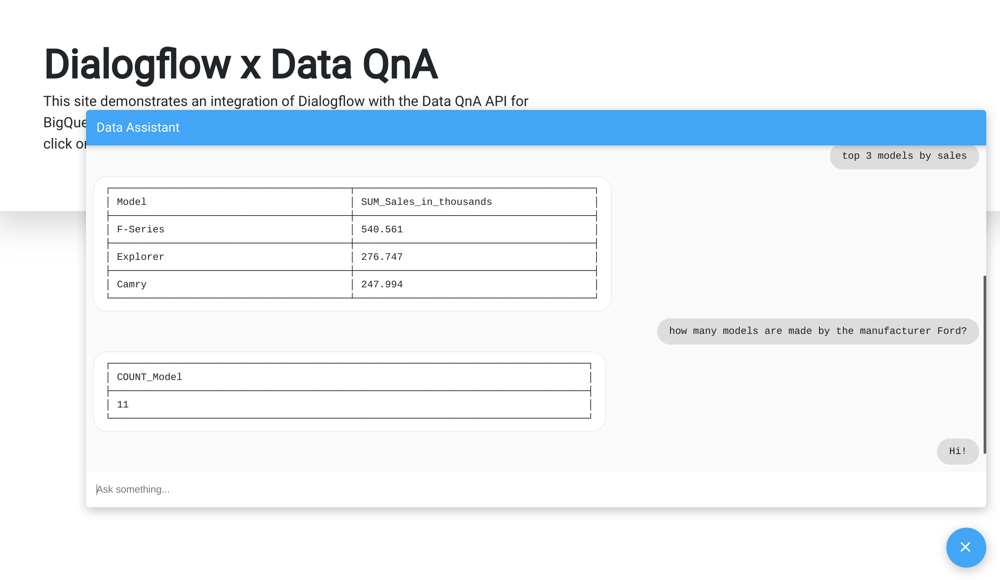

# Dialogflow-Data QnA integration demo

This repository contains the exported agent and fulfilment code to demonstrate integration of dialogflow with Data QnA

## What does it do?
This demonstration sets up a dialogflow agent with two intents - a default welcome intent and a catch-all fallback intent. The fallback intent passes all queries to the Data QnA API to convert it to a BigQuery SQL query. If the query is valid, it returns the result of the query. If not, it notifies the user that the query is invalid.

## Setup
Clone the source code to a folder, say `dialogflow-dataqna-demo`. Then, follow the steps in the given order
### Infrastructure and Services
1. [Create](https://cloud.google.com/dialogflow/es/docs/quick/build-agent#create-an-agent) a new Dialogflow agent
2. Select a BigQuery table to query, and [enable](https://cloud.google.com/blog/products/data-analytics/introducing-data-qna) Data QnA on it
3. Enable the BigQuery and Data QnA APIs on your project
_Note_: The Data QnA API is currently in Alpha, and needs to be allowlisted on your project before it can be used. Contact the Data QnA product team for support

### Dialogflow agent
In the new agent, under `Settings > Export and Import`, select 'Restore from ZIP'. Select the `agent.zip` file from the repository. This will create the necessary intents

### Fulfilments
1. Enable the inline editor under `Fulfilments`
2. Extract the `fulfilments.zip` file from the repository. It will contain two files - `index.js` and `package.json`. Copy the two files to the respective destinations in the inline editor
3. Fill in the credentials and information under the "Credentials and Info" section of `index.js` as directed by the comments
4. Click on 'Deploy' to create a new Cloud Function to handle the fulfilments

### Dashboard
1. Install and set up a web server on a GCE VM
2. Place the two files under the `dashboard` directory, `index.html` and `script.js`, in the web server's document root
3. In the Dialogflow console, select and enable the 'Dialogflow Messenger` integration under the `Integrations` tab
4. Copy the HTML and script tag for the integration, and place it in the `index.html` file as indicated by the comment

That's it! You can now visit the URL of your web server to view the dashboard, and ask natural language queries on your BigQuery data in the chat window
_Note_: One caveat is that Dialogflow fulfilments time out in 5 seconds, so long-running queries may not return a result. The messenger displays and error message in this case. This can be overcome by asynchronous fulfilments, which is an upcoming feature. Alternatively, if using Dialogflow CX, a ticket can be raised for increasing the timeout up to 30 seconds
